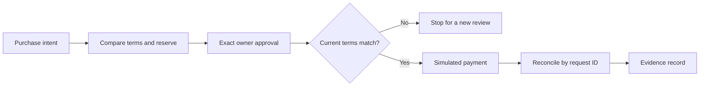

# Kairos Procurement Demo

**Approved. Resumable. Verifiable.**

An interactive idea-stage prototype for [Airwallex Agentic Banking Hackathon](https://airwallex.hackerearth.com/) Starter Kit 02: Intent-Bound Purchase Agent. Kairos is the transaction layer for AI agents.

> Browser-only simulation. No real payments, bank connection, card issuance or LLM calls. Do not enter credentials or real financial data.

## Run locally

Node.js 22 recommended.

```sh
npm ci
npm run dev
```

Open the local URL printed by Vite. Production build and policy/recovery checks:

```sh
npm test
npm run build
npm run preview
```

## Deploy to Vercel

Import **use-kairos/kairos-procurement-demo**, branch **main**.

| Setting | Value |
| --- | --- |
| Framework preset | Vite |
| Root directory | Repository root (`./`) |
| Install command | `npm ci` |
| Build command | `npm run build` |
| Output directory | `dist` |
| Node.js | 22.x |
| Environment variables | None |

There is no backend, secret or database to configure. This repository does not deploy automatically to Vercel; the owner will create the Vercel project.

## The decision

The team has $1,400 in cash, owes $650 in payroll and requires a $400 reserve. A fictional LedgerFlow subscription costs $100 monthly or $984 annually. Annual billing saves 18%, but leaves −$234 after payroll. Monthly billing leaves $650.

The owner approves one purchase from LedgerFlow for USD 100 on monthly terms, valid for five minutes. This is not approval for automatic recurring charges.



## Try the scenarios

Select a scenario before approving; Reset starts a new independent simulation.

| Scenario | Expected result |
| --- | --- |
| Approved purchase | One simulated payment and a receipt. Replay returns that same payment. |
| Price changes | $110 request differs from the $100 mandate; zero charges. |
| Supplier changes | Unknown reseller differs from approved supplier; zero charges. |
| Interrupted response | A simulated provider record exists before receipt capture. Reload and resume reconcile it without another charge. |

Download the JSON evidence to inspect approved terms, events and payment count. Browser storage preserves the current simulation across reloads on the same origin. Reset erases that simulation. The event log is not signed or tamper-resistant.

## Existing implementation vs proposed build

**Implemented:** deterministic policy decisions, approval expiry and exact-term checks, single-request recovery simulation, responsive UI, browser persistence, JSON evidence export, executable tests.

**Proposed hackathon work:** server-side authorization and durable state, Airwallex sandbox balances and virtual cards, supported card spending controls, sandbox charge simulations and reconciliation using actual provider identifiers. Exact supplier/billing-term enforcement requires application checks unless verified provider capabilities support it. The frontend is not a trusted authorization boundary. No production reliability or cryptographic guarantee is claimed.

See [architecture and integration plan](docs/architecture.md) and [copy-ready Idea submission](docs/idea-submission.md).

## Provenance

This is a separate public repository, with no private source history or configuration. It adapts the agent workspace presentation and Avatar component from the pre-existing [Banking 2035 demo](https://banking-2035-demo.vercel.app/), developed for Granite Fellows Group 9 in Singapore. The new procurement scenario and simulation are pre-event concept preparation, not official build-period work. See [NOTICE](NOTICE.md) for asset attribution and source commit.

Code is MIT licensed. Kairos names and brand artwork are excluded from that license. Third-party assets retain their own terms.
